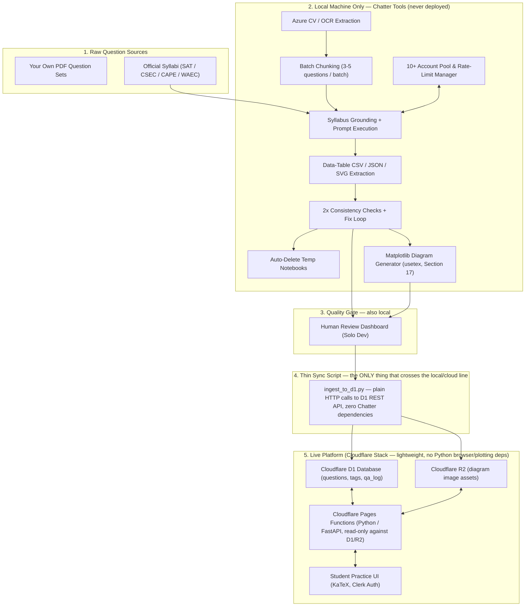

# AI-Powered Exam Prep Platform — Implementation Plan

*Built from your Aug 3–9, 2026 notebook entries + your follow-up answers. Solo founder, launch ASAP, starting from zero code.*

---

## 0. How to read this document

- **Locked decisions** — things you've confirmed, stated as fact.
- **My recommendation** — I'm giving you a specific answer to a question you left open, with reasoning, because you asked me to stop asking and start deciding where I reasonably can.
- **⚠️ Still your call** — genuinely open items where I need a decision from you before the plan can be finalized (mostly monetization + naming + dates).
- **🚩 Risk flag** — something that could break your plan later if you don't design around it now.

---

## 1. Product Definition (Locked)

| Item | Decision |
|---|---|
| Primary audience | SAT students |
| Secondary audience | CSEC, CAPE, WAEC students — mainly for **Math** overlap questions |
| Phase 2 audience | University-level questions (once revenue supports it) |
| Launch subjects | Math (general), Pure Math, Applied Math, SAT Math, Physics, SAT English |
| Content origin | 100% original. Two source types: (1) your own PDF question sets, extracted and lightly AI-checked; (2) SAT-style questions **fully regenerated from scratch** by AI using general SAT question *concepts* — never lifted from College Board or copyrighted material |
| Solo project | Yes, starting from zero code |
| Timeline | ASAP — plan below is sequenced so you have something live fast, then layer in the AI pipeline |

🚩 **Risk flag — copyright:** Even "using the general idea of an SAT question" is fine (styles/formats/question types aren't copyrightable), but if your AI ever *paraphrases* an actual retired College Board question closely (same numbers, same wording structure, same passage), that crosses from "inspired by" into "derivative of." Build a filter step where the AI that generates SAT-style questions is **never shown real College Board questions as direct input** — only shown a syllabus/topic list and told to invent something new. Never feed real exam PDFs into the "generate new SAT question" prompt.

---

## 2. The Content Pipeline (this is your actual product)

Based on your answers, here is the full pipeline as a numbered flow. I reordered/labeled your steps into stages so we can build them one at a time instead of all at once.

### Stage A — Ingestion
1. You upload a PDF of your own question set.
2. PDF is split into per-question images (one question = one image).
3. Azure Computer Vision (Smart Crop / Read API) extracts the image + does OCR/description.
4. A cheap/low-level AI converts the OCR output + image description into **structured text** (question stem, answer choices, correct answer if visible, any diagram described in words instead of passed as pixels — this is the "reduce AI strain" idea you had, and it's a good one: text-only downstream calls are cheaper and more reliable than vision calls at every step).

### Stage B — Draft Creation
5a. **If sourced from your own PDFs:** send structured text to a low-level AI to clean up formatting/LaTeX, no fabrication.
5b. **If it's an SAT-style question with no direct source:** send a prompt containing *only* the syllabus/topic + difficulty target (never a real College Board question) to a high-level AI to generate an original question from scratch.

### Stage C — Internal QA (before it ever reaches a student)
6. First-pass check: a low-level AI re-reads the question for internal consistency (does the math actually work, are all 4 answer choices distinct, is there exactly one correct answer). You said you want this done **twice** — so this is two independent low-level AI passes, ideally with a re-generation or fix step in between if pass 1 finds a problem.
7. Categorization: an AI assigns subject, topic, sub-topic, and difficulty.
8. Explanation generation: AI writes the worked solution (text + LaTeX, no video yet — confirmed by you).
9. Cross-exam mapping: a high-level AI compares the question against **syllabus documents** for SAT/CSEC/CAPE/WAEC (you confirmed official syllabi exist and can be extracted) and tags which exams a question is valid for, plus assigns a difficulty ranking usable across exams.
10. Final high-level review pass (Fable or another top-tier model): reviews a **batch of ~100 questions at a time**, and for any it doesn't approve, returns the question UUID + the specific reason it flagged it — not just a pass/fail.

### Stage D — Fix Loop
11. Flagged UUID + reason gets programmatically routed to a "fixer" AI call, which attempts a correction using the original question + the flag reason as input.
12. **Every AI-generated fix, without exception, goes through a human (you) review step before going live.** This is your explicit rule and it's the right one for launch — it's your only hard quality gate as a solo dev.
13. Configurable low-level AI passes (via `qa_pass_count`).
14. **Failed-fix handling (Locked Decision):** If a question fails Stage D's fix loop repeatedly (e.g. fixer AI cannot resolve the flag after configured retry threshold), its status is automatically set to `needs_human_rewrite` and routed to your **manual review inbox**. It is safely pulled from the automated queue so it never causes infinite loops or blocks batches.

### Stage E — Storage & Serving
15. Approved question goes into the live database, versioned (see schema below) so a later "fix" doesn't destroy the audit trail of what changed and why.

---

## 3. Data Model (Recommendation)

### Question format — Final Decision (not just a recommendation this time)

**Renderer: KaTeX (v0.16+), client-side.** Not MathJax — KaTeX renders synchronously with no layout reflow, which matters when a page shows a dozen equations at once. Not server-side image rendering — that's slower, bigger, unsearchable, and un-editable if you need to fix a typo later.

**Delimiters: `\(...\)` for inline math, `\[...\]` for display/block math. Never `$...$` or `$$...$$`.** This is a firm decision, not a style preference: your content is full of word problems that legitimately contain a literal dollar sign ("*a shirt costs \$25*"), and if `$` is also your math delimiter, you get ambiguous or broken parsing the first time a question mixes currency and an equation in the same sentence. Every generation/rewording prompt below is written to enforce this.

**Command whitelist — the actual subset every prompt is instructed to use, and the only subset the validator (below) accepts:**

| Category | Allowed commands |
|---|---|
| Arithmetic/algebra | `\frac`, `\sqrt`, `\sqrt[n]{}`, `^{}`, `_{}`, `\times`, `\div`, `\cdot`, `\pm`, `\mp`, `\leq`, `\geq`, `\neq`, `\approx`, `\equiv` |
| Sets/logic (Pure Math) | `\in`, `\notin`, `\subset`, `\cup`, `\cap`, `\emptyset`, `\forall`, `\exists` |
| Functions | `\sin \cos \tan \sec \csc \cot`, `\log`, `\ln`, `\exp`, `\lim` |
| Calculus (Pure/Applied Math, CAPE) | `\int`, `\iint`, `\sum`, `\prod`, `\frac{d}{dx}`, `\partial`, `\nabla`, `\infty` |
| Vectors/matrices (Applied Math, CAPE) | `\vec{}`, `\overrightarrow{}`, `\begin{pmatrix}...\end{pmatrix}`, `\begin{vmatrix}...\end{vmatrix}`, `\det` |
| Piecewise/systems | `\begin{cases}...\end{cases}` |
| Geometry | `\circ` (degrees), `\angle`, `\triangle`, `\perp`, `\parallel`, `\overline{AB}`, `\hat{}` |
| Greek letters | `\alpha \beta \gamma \theta \pi \mu \sigma \phi`, `\Delta \Sigma \Omega` |
| Misc | `\binom{}{}`, `\overline{}`, `\text{}` (for units/labels inside math mode) |

Nothing outside this table gets used — no `tikz`, no `mhchem`, no custom macros, no arbitrary packages. This is deliberately narrow: a smaller surface area means the AI almost never produces something KaTeX can't render, and it means *you* know exactly what syntax can ever appear in your database.

**Automated validation (code, not AI — this is a free, deterministic QA gate):** at ingestion time, every `stem_latex`, `choice_latex[]`, and `explanation_latex` string gets run through `katex.renderToString(text, { throwOnError: true, strict: 'error', trust: false })` in a small Node script as part of Stage C. Any command outside the whitelist or malformed syntax throws immediately, with a specific error message. **Wire this straight into your existing flag/fix loop** (Section 2, Stage D) — a KaTeX render failure auto-flags the question with the exact parser error as the `reason_text`, no AI call needed to catch it. This is the cheapest, fastest QA check in your whole pipeline and it should run *before* any AI review step, not after — no point spending an AI call reviewing a question whose LaTeX doesn't even render.

Store the raw LaTeX string in the schema below (never a rendered image or HTML) — it's smaller, searchable, editable, and portable if you ever swap renderers.

### Suggested schema (conceptual, not final SQL — we'll write real SQL when we scaffold D1)

```
questions
  id (uuid, primary key)
  group_id (uuid, nullable — links multi-part sub-questions sharing a parent context/diagram)
  label_path (text — breadcrumb identifier, e.g. "1", "1(a)", "1(a)(i)", "1(a)(ii)(A)")
  part_order (int — sorting order for rendering sub-questions sequentially)
  version (int)
  status (draft | in_qa | flagged | needs_human_rewrite | approved | retired)
  source_type (own_pdf | ai_generated)
  subject (enum: math, pure_math, applied_math, sat_math, physics, sat_english)
  topic, subtopic
  difficulty (int, cross-exam normalized scale)
  context_latex (text, nullable — shared setup/passage/stimulus text for multi-part questions)
  stem_latex (text — specific question prompt)
  choices (json array of latex strings)
  correct_choice_index (int)
  explanation_latex (text)
  diagram_description (text, nullable — dense verbal description)
  diagram_asset_url (text, nullable — URL to cropped SVG/PNG diagram in R2)
  created_at, updated_at

question_exam_tags
  question_id (fk)
  exam (enum: sat, csec, cape, waec)
  syllabus_topic_ref (fk to syllabus table)

qa_log
  id
  question_id (fk)
  stage (e.g. "pass_1", "highlevel_review", "fix_attempt")
  ai_model_used
  result (pass | flag)
  reason_text
  timestamp

fix_history
  question_id (fk)
  previous_version_snapshot (json)
  fix_reason
  fixed_by (ai | human)
  reviewed_by_human (bool)
  timestamp
```

This gives you exactly what your notes asked for: a flag reason travels with the UUID, every fix is logged, and nothing overwrites history silently — important both for debugging your AI pipeline and for the "keep an error log of what broke and how it was fixed" system you described for the app itself (see Section 6).

---

## 4. AI Model Assignment

| Pipeline step | Model tier you specified | Note |
|---|---|---|
| OCR → structured text | Low-level / NotebookLM | Cheap, high volume |
| Draft cleanup (own-PDF questions) | Low-level / NotebookLM | |
| Original SAT question generation | High-level (Fable or TBD) | Needs creativity + correctness |
| First 2 consistency passes | Low-level | |
| Categorization | Low/mid-level | |
| Explanation generation | Mid-level (needs to be *correct*, not just fluent) | |
| Cross-exam syllabus mapping + difficulty ranking | High-level | This needs real reasoning across multiple syllabi at once — don't cheap out here, it's the step most likely to silently produce wrong tags |
| Batch-of-100 final review | High-level (Fable) | |
| Fix attempts | Mid/high-level | |
| Extra 3 low-level passes | Low-level | Configurable count, see Stage D |

🚩 **Risk flag — NotebookLM has no official public API (Mitigated by your existing NotebookLM Chatter tool):**
programmatic access to NotebookLM relies on browser cookies and internal endpoints. **However, you have already built a full, robust automation system in `C:\Users\ralme\Documents\Failbetter\notebooklm chatter`** that mitigates the primary operational risks:
- It maintains a **multi-account pool (10+ accounts)** with automated cookie sync and live login verification.
- It features **automatic rate-limit detection and hot-swapping** to backup profiles when an account enters cooldown.
- It includes **batch queueing, automated notebook cleanup, and `generate_data_table` direct CSV artifact extraction**.

**Architecture Rule:** Keep the pipeline's "AI call" step behind an **abstracted provider interface** (`AiProvider`). NotebookLM Chatter will serve as your primary **$0-cost batch ingestion & QA worker engine**, but having the interface abstracted ensures that if you ever want to route certain steps to paid Azure/OpenAI/Gemini APIs, you can swap providers with zero refactoring.

**Confirmed AI Models (Locked Decision):**
- **Low-level / High-volume Ingestion:** NotebookLM Chatter (primary $0 cost) with `gpt-4o-mini` (Azure/OpenAI) as programmatic structured-JSON fallback.
- **High-level Reasoning & QA (Fable-tier slots):** `gpt-4o`, `o3-mini`, and `o1` via Azure/OpenAI for Stage B5b (original SAT generation), Stage C9 (cross-exam syllabus mapping), and Stage C10 (batch review).

---

## 5. Auth: Clerk vs Supabase — Answered

You asked whether Clerk's free tier requires a credit card. **Current answer (verified Sept 2026): No.** Clerk's free "Hobby" plan does not require a credit card and was significantly expanded in Feb 2026 to **50,000 Monthly Retained Users** (up from the old 10,000 MAU figure — a lot of outdated info online still says 10k, don't trust older blog posts on this). It includes: unlimited applications, prebuilt sign-up/sign-in UI, custom domains, and social login.

**My recommendation: use Clerk**, not Supabase Auth, for this project specifically because:
- 50k free users is far more than you'll need at launch.
- No credit card removes your stated blocker entirely.
- Clerk's prebuilt UI components save you real development time as a solo dev — you don't want to be hand-building password reset flows this early.
- Clerk also has a startup credit program (up to $150k over 2 years for funded startups, $5k/6mo for bootstrapped) if you ever need it later — you likely won't for a long time given the free tier size.

Keep Supabase in your back pocket only if you end up wanting Postgres (row-level security, complex relational queries) *instead of* D1 for your main database — that's a separate decision from auth (see Section 7).

---

## 6. Hosting, Domain, and Your CORS Question — Answered

**Python on Cloudflare:** Yes, this now works well. Cloudflare's Python Workers runtime (Pyodide-based) has matured significantly through 2026 — `pip install` works, FastAPI/Flask/Django all run, and there are official examples for FastAPI+D1 and Flask+D1 apps. This directly supports your plan to build the backend in Python.

**Your CORS question — I want to correct the premise before you spend money on it.** You asked: "if I have my own domain, would I avoid the CORS issues I'd get from Cloudflare Pages + a separate Function, so should I just get a domain instead?" Here's the actual mechanics: **CORS is about cross-origin requests, not about whether a domain is custom or free.** If you put your Pages Functions inside the same project as your Pages site (using the `/functions` directory convention), your API routes live on the *same origin* as your frontend automatically — `yoursite.pages.dev/api/...` calling from `yoursite.pages.dev` is same-origin, no CORS involved, whether that domain is a free `.pages.dev` subdomain or a custom one you paid for.

You'd only hit CORS if you deployed the frontend and backend as two *separate* Cloudflare projects/domains. **My recommendation: don't do that — keep Pages + Pages Functions as one project.** This means your domain choice becomes purely a branding/professionalism decision, not a technical one. That simplifies Section 6a below considerably.

### 6a. Domain — GitHub Student Pack Free Domain (Locked Decision) & Clerk Compatibility

**Decision:** You will use a free domain provided via the **GitHub Student Developer Pack** (e.g. from Namecheap, Name.com, or Radix).

**Does a GitHub Student Pack domain work with Clerk? Yes, 100%.**
- A GitHub Student domain is a standard, fully functional custom domain (like `yourname.me` or `prepgenius.tech`).
- To connect Clerk to your GitHub student domain, you simply add Clerk's standard DNS CNAME records (e.g. `clerk.yourdomain.me`, `accounts.yourdomain.me`) in your domain DNS manager (or Cloudflare DNS if proxying).
- Clerk handles SSL certificate generation and authentication flows seamlessly on custom student domains with zero restrictions.

### 6b. Hosting summary
- **Frontend:** Cloudflare Pages (free plan) ✅ your existing plan is solid.
- **Backend:** Cloudflare Pages Functions, written in Python (Flask or FastAPI, per the examples above) ✅
- **Free-plan constraint you flagged is real:** Cloudflare's free plan has a **50 read subrequests per Worker invocation** limit (vs 1000 on paid) — this matters if a single API call needs to hit the database multiple times (e.g., fetch question + fetch related exam tags + fetch explanation in one request). Design your endpoints to batch these into single, well-indexed queries rather than looping, both for this limit and for cost (see D1 below).

---

## 7. Database — D1 Answered

You asked if D1 is a bad choice. **It's a reasonable choice for launch, with one hard constraint you need to design around from day one:**

Cloudflare D1 free tier (current, verified):
- **5 GB total storage**
- **5,000,000 row reads/day**
- **100,000 row writes/day**
- 🚩 **As of September 1, 2026, Cloudflare started hard-enforcing these limits** — free-plan D1 queries now *fail with an error* once you exceed the daily read/write cap, rather than degrading gracefully, until the quota resets at midnight UTC. This is brand new — many tutorials online predate this and describe softer behavior. Plan for it as a hard wall, not a soft warning.

**What this means practically for your app:**
- 5M reads/day sounds huge, but "reads" count *rows scanned*, not queries run. An unindexed query that scans a 50,000-row question table on every page load will burn through your quota fast at any real traffic. **Index every column you filter or sort by** (subject, topic, exam tag, difficulty) from the start — this isn't optional polish, it's what determines whether D1 survives your free tier or not.
- 100,000 writes/day is the one to watch given your AI pipeline: every QA pass, every flag log entry, every fix history record is a write. If you're running batches of 100 questions through 5–6 AI review stages each logging to `qa_log`, that's potentially 500–600 writes per 100 questions processed — meaning ~16,000–20,000 questions/day of *processing* before you hit the ceiling, not user activity. Budget for this when deciding how large a batch to run per day, and consider only writing to `qa_log` on flags/failures rather than logging every single pass, to conserve quota.

**Verdict: D1 is fine to start.** If you outgrow it, migrating a well-indexed relational schema off D1 later (to Postgres/Supabase) is a known, doable migration — don't let fear of a future migration stop you from shipping now.

---

## 8. Security & Anti-Scraping — Honest Assessment

You clarified the real threat: not screenshot/copy-paste prevention (you've accepted that's unwinnable), but **preventing someone from scraping your entire database** to clone your product. Here's what actually helps vs. what's theater:

**Worth doing:**
- Never expose an endpoint that can return more than a small page of questions at once (e.g., cap at 20 per request, always paginated) — a scraper then needs thousands of requests instead of one.
- Rate-limit per user/IP at the Cloudflare Worker level (Cloudflare has built-in rate limiting rules, free plan includes basic ones).
- Require authentication (Clerk) to view *any* question content — no anonymous access to the question bank at all. This alone stops casual/anonymous scraping tools.
- Add **Cloudflare Turnstile** (free, privacy-friendly CAPTCHA alternative) on sign-up to slow down bot account farming, since a scraper would otherwise just create thousands of free accounts to page through your paginated API.
- Detect anomalous access patterns (one account hitting the questions endpoint hundreds of times/minute) and auto-suspend — simple to build as a counter in D1 or Cloudflare KV.

**Not worth building (theater, easily defeated, not a good use of solo-dev time):**
- Disabling right-click / text selection — trivially bypassed, annoys real users, no real protection.
- Rendering questions as images to prevent copy-paste — defeats OCR the same way you're already using OCR yourself, and hurts accessibility/SEO for no real gain.

**Bottom line:** rate limiting + pagination + required auth + bot detection on signup gets you 90% of realistic protection for 10% of the effort. Perfect scrape-proofing doesn't exist for any web product — the goal is to make it not worth the effort, not to make it impossible.

---

## 9. Monetization — Free Launch with Easy Paywall Activation (Locked Decision)

**Locked Strategy:**
1. **Launch Mode:** Free access (+ Google AdSense), removing payment gateway friction from the MVP launch.
2. **Architecture from Day 1:** The database schema (`users.subscription_tier`, `subscriptions` table) and backend route middleware will be built with a global configuration switch:
   ```python
   PAYWALL_ENABLED = False # Flip to True when ready to monetize
   FREE_TIER_DAILY_QUESTION_LIMIT = 10
   SUBSCRIPTION_MONTHLY_PRICE_USD = 5.00
   ```
3. **Subscription Price Target:** **$5 / month**.
4. **Activation Flow:** When you decide to turn on paid tiers, you simply connect Stripe / LemonSqueezy webhook endpoints, set `PAYWALL_ENABLED = True`, and the backend automatically gates questions beyond the daily free quota or locks advanced exam-specific question sets to active subscribers.

---

## 10. The "Programmatic Testing AI" and Error Log — Confirmed Scope

To confirm what you described: you want an AI (or AI-assisted test suite) that checks the **UI and backend** — broken buttons, interface bugs, random errors — separate from the question-correctness QA pipeline in Section 2. And you want a persistent **local error log** (not in the cloud DB, gitignored) that records: what broke, how it was fixed, plus optionally a running list of "good patterns" the AI can reference for future work.

This is really an internal dev-tooling feature, not a user-facing one, so it doesn't block launch — I've placed it in Phase 4 of the roadmap below rather than Phase 1. It's a good habit to build once you have more than a handful of files, but building it before you have a working MVP would be solving a problem you don't have yet.

---

## 11. Systems Design Course — My Actual Opinion

You asked whether you should take a systems design course before starting, so the app is built to scale. **My recommendation: no, not as a prerequisite — build first, learn just-in-time.** Reasoning: systems design courses teach for scale problems (millions of users, distributed consensus, sharding) that don't apply to a pre-launch solo MVP, and the material won't stick as well without a real system of your own to map it onto. You will get far more out of a systems design resource *after* you've built and deployed this once, when you have real bottlenecks to reason about.

What I'd actually recommend instead: as you build, whenever you make an architecture decision in this plan (D1 vs Postgres, pagination limits, rate limiting), spend 15 minutes reading *why* that pattern exists rather than just implementing it. That gives you the systems-design intuition incrementally, attached to real decisions, which sticks better than abstract course material — and costs you zero upfront time before you can start shipping.

---

## 12. Phased Build Roadmap

### Phase 0 — Foundation (before any AI pipeline exists)
- [ ] Register domain (Section 6a decision)
- [ ] Set up Cloudflare Pages project + Pages Functions (Python/FastAPI)
- [ ] Set up Clerk auth, wire up sign-up/sign-in
- [ ] Set up D1 database with the schema from Section 3 (start simple, migrate as needed)
- [ ] Build a bare-bones admin-only interface for *you* to manually add a question and see it render (no AI yet) — this proves the render pipeline (KaTeX etc.) works before you add AI complexity on top

### Phase 1 — Manual Content, Real Users
- [ ] Manually load a small set of your existing PDF questions (hand-transcribed, no OCR/AI yet) — enough to have a usable, if small, question bank
- [ ] Build the student-facing practice UI: browse by subject/topic, answer question, see explanation
- [ ] Launch free, no monetization, no AI pipeline live yet — get real users interacting with real (if manually-entered) content
- [ ] Add basic rate limiting + pagination + Turnstile from Section 8 — do this now, not later, it's cheap to add early and expensive to retrofit

### Phase 2 — Automate Ingestion with NotebookLM Chatter
- [ ] Connect **NotebookLM Chatter** (`notebooklm_batch_classify.py` / `app.py`) as your local ingestion worker engine
- [ ] Build Stage A (Azure Computer Vision extraction from your PDFs into structured text)
- [ ] Route extracted questions into NotebookLM Chatter with syllabus PDF grounding for draft LaTeX cleanup and classification
- [ ] Build the abstracted `AiProvider` interface (wrapping NotebookLM Chatter + future Azure models)

### Phase 3 — QA Pipeline & Fix Loop
- [ ] Implement Stage C (consistency checks, multi-pass review, cross-exam syllabus tagging) via NotebookLM Chatter multi-account batch queues
- [ ] Implement Stage D (flag reason routing + fixer AI + human review gate)
- [ ] Turn on Stage B5b (AI-generated original SAT questions) once QA and human gate are fully validated

### Phase 4 — Scale, Polish & Rich Media
- [ ] Cross-exam syllabus mapping across all target exams (SAT, CSEC, CAPE, WAEC)
- [ ] Integrate NotebookLM Chatter's Manim math animation engine (`ap_problem_v4.py`) to auto-generate video/animated worked solutions for top-tier questions
- [ ] Diagram generation for original SAT questions (matplotlib/TikZ-generated code)
- [ ] Internal dev error-log tooling (Section 10)
- [ ] Freemium tier launch once you have real usage data (Section 9)

---

## 13. Decision Status & Open Items Log

| Item | Status | Locked Decision |
|---|---|---|
| **Domain & DNS** | **LOCKED** | Free domain via GitHub Student Pack (Namecheap/Name.com/Radix); Clerk CNAME records verified compatible. |
| **High-Level AI Models** | **LOCKED** | OpenAI family on Azure/OpenAI (`gpt-4o-mini` for fast structured JSON, `gpt-4o` / `o3-mini` / `o1` for high-level reasoning). |
| **Failed-Fix Queue Handling** | **LOCKED** | Option A: Repeatedly failing fix attempts route to `needs_human_rewrite` status in your manual review inbox. |
| **Monetization & Pricing** | **LOCKED** | Launch Free + Ads; pre-architected paywall switch (`PAYWALL_ENABLED`) ready for **$5/month** subscription. |
| **Diagram Generation (Phase 4)** | **LOCKED** | Local `diagram_chatter` with MiKTeX / TeX Live for SVG diagram generation; SVGs hosted on Cloudflare R2. |
| **Browser Math Rendering** | **LOCKED** | KaTeX (v0.16+) client-side (instant rendering, zero setup for students). |

---

## 14. NotebookLM Chatter Integration — How It Works, What It Can Do & How It Fits

You have an existing, fully working tool in `C:\Users\ralme\Documents\Failbetter\notebooklm chatter`. This section breaks down its architecture, capabilities, and exactly how it plugs into the SAT platform.

### 14.1 How It Works (The Engine Under the Hood)

NotebookLM Chatter is a production-grade local automation engine and Flask web application built around Google's NotebookLM platform:

1. **Multi-Account Profile Pool (`backend/notebooklm_client.py` & `simple_login.py`)**:
   - Manages a pool of authenticated Google accounts (`account_1.json` through `account_10.json`).
   - Extracts live cookies directly from local browser profiles (Chrome, Brave, Edge) and performs headless authentication handshakes.
   - Provides live status checks (`/api/accounts/pool-status`) showing which accounts are active, logged out, or in cooldown.
2. **Automated Cooldown & Hot-Swap Fallback (`backend/batch_scheduler.py`)**:
   - NotebookLM free accounts encounter rate limits (e.g. "wait a few seconds" or 50 queries/day). Chatter actively intercepts these errors, logs them to `rate_limits.json`, sets a 120s–300s cooldown timer on the exhausted account, and **instantly hot-swaps the running job to the next available backup account** without crashing or losing progress.
3. **RPC & Artifact Lifecycle Management**:
   - Uses direct RPC methods to spin up fresh notebooks, upload reference documents (syllabi, prompt instructions), ingest input CSVs/PDFs, trigger data-table artifacts (`generate_data_table`), download clean results, and delete disposable notebooks via `backend/clean_notebooks.py` to prevent hitting account storage caps.
4. **Dual Interfaces**:
   - **Interactive Web App (`app.py` + `templates/index.html` + `static/app.js`)**: Visual dashboard for monitoring account health, building prompt templates, queuing jobs, inspecting live execution steps, and resolving errored batches.
   - **Headless CLI Worker (`notebooklm_batch_classify.py`)**: Autonomous command-line pipeline that chunks folders of exam questions into batches of $N$ (e.g. 3), runs them through syllabus grounding, downloads clean CSVs, and merges them into unified datasets (`merge_csvs`).

---

### 14.2 What It Can Do (Key Features)

| Feature | Description | File Location in Chatter |
|---|---|---|
| **Syllabus Grounding** | Uploads official syllabus PDFs first so the model uses authoritative curriculum definitions before classifying questions. | `notebooklm_batch_classify.py` |
| **Data-Table Artifact Generation** | Uses NotebookLM's dedicated tabular artifact generation (`generate_data_table`) to export structured CSVs directly—avoiding conversational markdown chatter and parsing errors. | `notebooklm_batch_classify.py`, `backend/notebooklm_client.py` |
| **Multi-Format Extraction** | Extracts and formats Markdown tables to CSV, parses JSON data, and extracts embedded SVGs (critical for math diagrams and geometric figures). | `app.py` (`_markdown_table_to_csv`, `_extract_svg`, `_extract_json`) |
| **Account Pool Load Balancing** | Distributes batch jobs across 10+ accounts with cooldown tracking and round-robin scheduling. | `backend/batch_scheduler.py` |
| **Quota Maintenance & Cleanup** | Sweeps and deletes completed temporary notebooks across all profiles while protecting designated master profiles (e.g. `'slave'`). | `backend/clean_notebooks.py` |
| **Manim Math Video Generation** | Generates fully narrated, timed mathematical animation video scripts with chapter markers and paced working lines using Manim. | `ap_problem_v4.py` |

---

### 14.3 How It Directly Helps the SAT Platform

1. **Solves the $0-Cost Ingestion & QA Challenge**:
   - Processing thousands of exam questions through multiple AI passes (OCR cleanup, categorization, 2x consistency checks, explanation generation) would quickly burn through paid API credits.
   - NotebookLM Chatter leverages your 10+ account pool to perform these heavy lifting passes at **$0 marginal cost**.
2. **Eliminates Manual Bottlenecks**:
   - Instead of manually uploading PDFs to NotebookLM's web UI and copying responses one-by-one, Chatter chunks, runs, recovers from cooldowns, and outputs merged clean CSVs/JSON files fully unattended overnight.
3. **Guarantees Syllabus Accuracy (Stage C9)**:
   - By attaching official SAT, CSEC, CAPE, and WAEC syllabus documents as grounding sources, Chatter ensures question tagging and difficulty rankings strictly adhere to real exam board criteria.
4. **Unlocks Visual / Video Explanations (Phase 4)**:
   - The Manim script generator (`ap_problem_v4.py`) provides an out-of-the-box foundation to convert text explanations into animated video solutions for high-value SAT Math problems.

---

### 14.4 Concrete Integration Architecture

NotebookLM Chatter sits as the **Local Offline Ingestion & QA Worker Engine** that feeds your cloud database (Cloudflare D1). **Hard boundary rule: nothing in the Chatter tools (Selenium/Playwright browser automation, Flask, matplotlib, OCR libraries, NotebookLM RPC clients) ever gets deployed to or imported by the Cloudflare Pages/Functions codebase.** The only thing that crosses from local machine to cloud is the final, human-approved question JSON (and rendered diagram assets), pushed by a small, dependency-light sync script. This keeps your production web app's dependency footprint small — it never needs a browser automation stack or a plotting library, it only ever needs to read rows from D1 and serve JSON to the frontend.



#### Step-by-Step Workflow:
1. **Batch Preparation**: Drop extracted question texts/CSVs and the relevant syllabus PDF into Chatter's input folder.
2. **Autonomous Execution**: Run `notebooklm_batch_classify.py` or trigger a batch job via the Chatter Web UI. Chatter manages the account rotation, handles any cooldowns, generates the structured data-table artifacts, and outputs merged clean CSVs.
3. **Human Gate & D1 Ingestion**: Run a lightweight local Python script (`scripts/ingest_to_d1.py`) that loads the Chatter CSV/JSON output into your staging review queue, lets you approve verified questions, and writes them directly into Cloudflare D1 via Wrangler CLI / D1 REST API.

---

### 14.5 Honest Risk Assessment — Read This Before You Depend On It

The engineering here is genuinely good — cooldown detection, hot-swap, RPC-level artifact extraction instead of scraping markdown. But I want to be direct about how a 10-account pool changes the risk profile versus casual single-account use, because this is now load-bearing for your entire content pipeline, not a side tool.

**Why 10 accounts is a materially different risk than 1:**
- A single person manually using NotebookLM through the browser looks like normal usage. A system that logs into 10 separate Google accounts, detects rate limits programmatically, and automatically redistributes load across them the moment one gets throttled is functionally identical to what abuse-detection systems are built to catch — coordinated automation designed specifically to route around a per-account usage limit. Whether or not that's your intent, that's the pattern.
- If Google's abuse detection flags the behavior (shared cookie fingerprints, correlated login IPs, near-identical request timing across "different" accounts) it can plausibly act on the **pattern**, not just one account — meaning a ban wave could take out multiple or all 10 accounts in the same event, not just whichever one happened to trip a limit that day. I can't tell you the actual probability of this (Google doesn't publish it), but the failure mode is correlated, not independent, which is the important part for your planning.
- Google can also change the frontend/RPC surface at any time with zero notice, since none of this is a published, versioned API. `generate_data_table` and the cookie-based auth handshake are both unofficial integration points — they work today because they haven't changed, not because they're contractually stable.

**This doesn't mean stop using it.** For a $0-budget solo MVP it's a reasonable bet, and you've clearly already engineered around the *soft* failure modes (rate limits, cooldowns) well. What it means is: **don't let Chatter become a single point of failure for content you can't otherwise produce.**

Concrete ways to de-risk without giving it up:
1. **Keep it strictly behind the `AiProvider` abstraction** (already planned in Section 4) — this is now non-negotiable, not just good practice, given the correlated-ban risk above.
2. **Never let Chatter be the only copy of anything.** Keep raw extracted question text and syllabus source docs stored independently of Chatter's output, so a sudden account-pool loss costs you re-processing time, not source data.
3. **Treat the human review gate (Section 2, Stage D) as also your safety net for silent Chatter degradation** — if NotebookLM starts quietly returning worse output (not an error, just lower quality) because of a backend change, your existing human-approval requirement is what catches it, not a monitoring system you'd need to build separately.
4. **Budget a small amount of paid API usage as a fallback path**, even if you don't use it day-to-day — knowing that "if the whole pool goes down tomorrow, I can finish this week's batch on Azure for $X" turns an existential risk into an annoying but survivable cost. You don't need to build this now, just don't assume $0-cost ingestion is a permanent floor when you're estimating your runway.

None of this changes Phase 2/3 of the roadmap below — Chatter is still the right $0-cost starting engine. It just means the `AiProvider` abstraction and the "don't lose source data" rule move from "nice architecture" to "the thing that determines whether a Google account decision six months from now takes down your business or just your Tuesday."

---

## 15. A Dedicated Extraction/Rewording Chatter — Architecture

You're right to want this split out. Extraction + rewording (Stage A + Stage B5a) is a fundamentally different job from classification + syllabus grounding + final review (Stage C): it runs *much* earlier, *much* more often (every question passes through it once; only a subset ever reaches high-level review), and it needs a narrower, simpler prompt contract.

**Since you're fine with two fully independent codebases, here's that version.** No shared library — each tool is a complete, standalone copy of the Chatter app, and they can diverge freely without one team's changes risking the other. The trade-off you're accepting is that an improvement to, say, cooldown handling has to be manually ported into both if you want both to have it — worth it for you because you'd rather have clean isolation than a shared dependency, and this is a solo project where you're the one deciding when to port a fix anyway.

```
extraction_chatter/                 ← full standalone copy, local machine only
  backend/
    notebooklm_client.py            (your existing account pool code)
    batch_scheduler.py              (your existing cooldown/hot-swap code)
    clean_notebooks.py
  prompts/
    extraction_structuring.txt      (Section 16.1)
    rewording_own_pdf.txt           (Section 16.2)
    diagram_description.txt         (Section 16.3)
  app.py                            (trimmed UI — extraction/rewording screens only)
  run_batch.py                      (headless CLI entry point)
  output_schema.json                (raw_ocr_text, reworded_stem, reworded_choices,
                                      correct_answer_raw, diagram_description — nothing else)

classification_chatter/             ← full standalone copy, local machine only
  backend/
    notebooklm_client.py            (your existing account pool code, copied)
    batch_scheduler.py              (your existing cooldown/hot-swap code, copied)
    clean_notebooks.py
  prompts/
    categorization.txt              (Section 16.6)
    syllabus_mapping.txt            (Section 16.8)
    batch_review.txt                (Section 16.9)
    fix_attempt.txt                 (Section 16.10)
  app.py                            (keeps the classification/review UI)
  output_schema.json                (question_id, subject, topic, difficulty, exam_tags[], flag_reason)

diagram_chatter/                    ← full standalone tool, local machine only (Section 17)
  generate_diagram.py               (matplotlib + usetex, reads whitelisted LaTeX, outputs SVG/PNG)

ingest_to_d1.py                     ← the ONLY script that talks to Cloudflare, at the repo root,
                                       zero dependencies on any of the three tools above beyond
                                       reading their finished JSON/image output off disk
```

**Both Chatter apps and the diagram tool run entirely on your local machine** — they're never deployed anywhere, never touch Cloudflare, and their dependencies (Selenium/Playwright, Flask, matplotlib, a local TeX installation) have zero relationship to what the production web app needs. The Cloudflare Pages Functions backend stays a small, focused FastAPI app whose only job is reading approved rows out of D1/R2 and serving them — it doesn't know Chatter exists. `ingest_to_d1.py` is the single narrow bridge between "stuff on your laptop" and "stuff live on the internet," and it should stay a plain script (HTTP calls to the D1 REST API or Wrangler CLI invocations) with no imports from the Chatter codebases — just reads their output files off disk.

**Why this split also helps with the Section 14.5 risk:** if Extraction Chatter and Classification Chatter run as separate processes hitting separate notebooks (even from the same account pool), a quota exhaustion or a prompt-format break in one doesn't stall the other — extraction can keep filling the queue while classification is down for a fix, or vice versa.

---

## 16. Prompt Library

All prompts below assume structured JSON output (Notebooklm's `generate_data_table` artifact, or a JSON-mode call on a paid model once you swap providers). Every prompt that touches math notation repeats the LaTeX rules from Section 3 explicitly — don't rely on the model remembering it from an earlier message in a batch; state it every time.

Placeholders are written as `{{like_this}}`.

### 16.1 — Extraction Structuring (Stage A4) · lives in `extraction_chatter`

```
SYSTEM:
You convert raw OCR text and an image description of one exam question into
clean structured JSON. You do not solve the question, evaluate it, or judge
its quality. You only transcribe and structure what is given.

Math notation rules:
- Inline math: \( ... \)
- Display/block math: \[ ... \]
- Never use $ or $$ for math — this document set contains real currency
  values and $ is reserved for that.
- Only use these LaTeX commands, nothing else:
  {{latex_whitelist}}

If the OCR text is ambiguous or clearly corrupted (garbled characters,
missing fragments), do not guess or fill gaps. Set "needs_human_review": true
and explain why in "extraction_notes".

USER:
Raw OCR text:
{{ocr_text}}

Image description (from computer vision, describing any diagram/figure in words):
{{image_description}}

Return JSON only, in this exact shape:
{
  "raw_stem": "string, using the math delimiter rules above",
  "raw_choices": ["string", "string", "string", "string"],
  "visible_correct_answer": "string or null if not visible in source",
  "diagram_description_verbatim": "string or null",
  "needs_human_review": boolean,
  "extraction_notes": "string, empty if none"
}
```

### 16.2 — Rewording / Cleanup for Own-PDF Questions (Stage B5a) · lives in `extraction_chatter`

```
SYSTEM:
You clean up and lightly reword an exam question that was authored by a
human (not extracted from any third-party exam). Your job is formatting
and clarity only — you must NOT change the mathematical content, the
correct answer, the difficulty, or invent any new information.

Math notation rules:
- Inline math: \( ... \)
- Display/block math: \[ ... \]
- Never use $ or $$ for math.
- Only use these LaTeX commands: {{latex_whitelist}}

Rules:
- Fix grammar, awkward phrasing, and inconsistent notation.
- Do not change numbers, variable names' meaning, or the correct answer.
- If you find a genuine mathematical error (e.g. the stated correct answer
  doesn't match your own check of the arithmetic), do NOT silently fix it.
  Flag it instead — this is not your job at this stage.

USER:
Original question (structured):
{{raw_stem}}
{{raw_choices}}
{{visible_correct_answer}}

Return JSON only:
{
  "reworded_stem": "string",
  "reworded_choices": ["string", "string", "string", "string"],
  "correct_choice_index": integer,
  "possible_error_flag": boolean,
  "possible_error_note": "string, empty if possible_error_flag is false"
}
```

### 16.3 — Diagram Description (used inside Stage A, feeds Stage B) · lives in `extraction_chatter`

```
SYSTEM:
You describe a mathematical or scientific diagram in precise words so that
a text-only AI (no vision) can fully understand its content without seeing
the image. Be exhaustive about anything that affects the answer: exact
labeled values, angle measures, which points connect to which, axis
scales and units, shaded regions, arrow directions. Do not describe purely
decorative/stylistic elements (colors, fonts) unless they carry meaning
(e.g. a dashed vs solid line indicating different data series).

USER:
[image of the diagram]

Return JSON only:
{
  "diagram_type": "string, e.g. 'coordinate graph', 'geometric figure', 'bar chart'",
  "full_description": "string, dense and literal, no interpretation of what the answer might be",
  "all_labeled_values": ["string", "string", "..."]
}
```

### 16.4 — Original SAT-Style Question Generation (Stage B5b) · lives in `classification_chatter` or a future high-level-model call

```
SYSTEM:
You write an entirely original multiple-choice question in the style and
difficulty range of the SAT, for a given topic. You have NOT been shown
and must NOT reference any real College Board question, past or present.
You are working from a topic/skill description only — invent new numbers,
new scenarios, and new phrasing from scratch.

Math notation rules:
- Inline math: \( ... \)
- Display/block math: \[ ... \]
- Never use $ or $$ for math (this platform's word problems include real
  currency amounts).
- Only use these LaTeX commands: {{latex_whitelist}}

Requirements:
- Exactly 4 answer choices, exactly one correct.
- All 4 choices must be plausible (no choice that's obviously wrong at a glance).
- Include at least one "distractor" choice representing a common student
  error for this topic (e.g. sign error, forgetting to distribute).

USER:
Topic: {{topic}}
Sub-topic: {{subtopic}}
Target difficulty: {{difficulty_level}} (1-5 scale)
Question format: {{format}} (e.g. "word problem", "pure algebraic manipulation", "graph-based")

Return JSON only:
{
  "stem": "string",
  "choices": ["string", "string", "string", "string"],
  "correct_choice_index": integer,
  "distractor_rationale": "string, explaining which choice targets which common error and why"
}
```

### 16.5 — Consistency Check (Stage C6, run this exact prompt for each configured pass) · lives in `classification_chatter`

```
SYSTEM:
You are checking one multiple-choice math/science question for internal
consistency ONLY. You are not checking style, difficulty, or curriculum fit.

Check specifically:
1. Does the stated correct answer actually follow from solving the
   question as written? Show your work.
2. Are all 4 answer choices numerically/logically distinct from each other?
3. Is there exactly one choice that is correct — could any other choice
   also be defensibly correct given the wording?
4. Is the question stem missing any information needed to solve it?

USER:
{{question_json}}

Return JSON only:
{
  "pass": boolean,
  "worked_solution_check": "string, your own independent derivation of the answer",
  "issues_found": ["string", "..."] (empty array if pass is true)
}
```

### 16.6 — Categorization (Stage C7) · lives in `classification_chatter`

```
SYSTEM:
You assign curriculum metadata to a question. Use only the categories and
topic names provided in the syllabus reference — do not invent new topic
names even if you think a better one exists.

USER:
Syllabus reference document (grounding source): {{syllabus_document}}
Question: {{question_json}}

Return JSON only:
{
  "subject": "one of: math, pure_math, applied_math, sat_math, physics, sat_english",
  "topic": "string, must match a topic name in the syllabus reference",
  "subtopic": "string, must match a subtopic name in the syllabus reference",
  "difficulty_estimate": integer (1-5),
  "difficulty_rationale": "string, one sentence"
}
```

### 16.7 — Explanation Generation (Stage C8) · lives in `classification_chatter`

```
SYSTEM:
You write a worked-solution explanation for a student, in the voice of a
patient tutor. Show every algebraic/logical step — do not skip steps a
struggling student would find confusing. End with the final answer clearly
restated.

Math notation rules:
- Inline math: \( ... \)
- Display/block math: \[ ... \]
- Never use $ or $$ for math.
- Only use these LaTeX commands: {{latex_whitelist}}

USER:
Question: {{question_json}}
Verified correct answer: {{correct_choice_index}}

Return JSON only:
{
  "explanation": "string, using the math delimiter rules above, multiple
    sentences/steps allowed, plain newlines between steps"
}
```

### 16.8 — Cross-Exam Syllabus Mapping (Stage C9) · lives in `classification_chatter`

```
SYSTEM:
You determine which exams a question is valid for, based ONLY on the
attached official syllabus documents for each exam. A question is valid
for an exam if the underlying skill/topic appears in that exam's syllabus,
even if the exam's own question style differs — you are matching
curriculum content, not question format.

USER:
Question: {{question_json}}
SAT syllabus reference: {{sat_syllabus}}
CSEC syllabus reference: {{csec_syllabus}}
CAPE syllabus reference: {{cape_syllabus}}
WAEC syllabus reference: {{waec_syllabus}}

Return JSON only:
{
  "valid_exams": ["sat", "csec", "cape", "waec"] (only include ones that match),
  "per_exam_topic_ref": {"sat": "string", "csec": "string", ...} (syllabus section matched, only for included exams),
  "cross_exam_difficulty_note": "string, e.g. 'harder than typical CSEC but standard SAT difficulty'"
}
```

### 16.9 — Batch Final Review (Stage C10, batch of ~100) · lives in `classification_chatter`

```
SYSTEM:
You are the final quality gate before questions go live on a student-facing
platform. Review this batch of questions. For each one, decide APPROVE or
FLAG. A flag must include a specific, actionable reason — never a vague
"this seems off." If you flag a question, state exactly what's wrong so a
different AI or a human can fix it without re-deriving the whole problem.

USER:
Batch of {{batch_size}} questions:
{{questions_batch_json}}

Return JSON only, one entry per question:
[
  {
    "question_id": "uuid",
    "decision": "approve" | "flag",
    "reason": "string, empty if approved, specific if flagged"
  },
  ...
]
```

### 16.10 — Fix Attempt (Stage D11) · lives in `classification_chatter`

```
SYSTEM:
You are given a question that failed review, along with the specific
reason it was flagged. Fix ONLY the issue described — do not rewrite parts
of the question that weren't flagged, and do not change the topic or
difficulty target.

Math notation rules:
- Inline math: \( ... \)
- Display/block math: \[ ... \]
- Never use $ or $$ for math.
- Only use these LaTeX commands: {{latex_whitelist}}

USER:
Original question: {{question_json}}
Flag reason: {{flag_reason}}

Return JSON only:
{
  "fixed_stem": "string",
  "fixed_choices": ["string", "string", "string", "string"],
  "fixed_correct_choice_index": integer,
  "fixed_explanation": "string",
  "what_changed": "string, one sentence describing exactly what you changed and why"
}
```

**One cross-cutting rule for all ten prompts:** every one of them returns strict JSON and nothing else — no preamble, no "Sure, here's the analysis." If you're driving these through NotebookLM's `generate_data_table` artifact as Chatter already does, this matters less (the artifact format forces structure), but the moment any of these routes through a raw chat-completion call on a different model, add an explicit "Return JSON only, no other text" instruction and a JSON-parse-with-retry step in each tool's backend, since free-text preambles are the single most common reason structured-output pipelines silently break.

---

## 17. Diagrams: Making the Same LaTeX Whitelist Work in Matplotlib

You need the LaTeX used in diagrams (axis labels, geometric annotations) to match the same notation students see in the question text — otherwise a student sees `\overrightarrow{AB}` in the question but a differently-formatted vector in the diagram, which reads as sloppy. Here's the actual compatibility situation, checked against current matplotlib behavior rather than assumed:

**The problem:** matplotlib's default math renderer (`mathtext`, no LaTeX installation required) implements only a *subset* of TeX. It handles most of your whitelist fine — `\frac`, `\sqrt`, superscripts/subscripts, `\times \div \cdot \pm`, `\leq \geq \neq \approx`, `\infty`, Greek letters, `\sin \cos \tan \log \ln`, `\binom`, `\overline`, `\hat`, `\vec` all work. **But mathtext does not support LaTeX environments at all** — no `\begin{pmatrix}...\end{pmatrix}`, no `\begin{cases}...\end{cases}`, no `\begin{vmatrix}...\end{vmatrix}`. Trying to render one of these with default mathtext throws a parse error, not a silently-wrong result — this is a known, longstanding limitation, not a bug that might get fixed under you.

**The fix — and it's a clean one since this tool is local, not on Cloudflare:** set `matplotlib.rcParams['text.usetex'] = True` in `diagram_chatter`. This tells matplotlib to shell out to a **real, full LaTeX installation** (TeX Live or MiKTeX) instead of its own limited parser, which means every command in your Section 3 whitelist — including the matrix/cases environments — renders identically to how KaTeX renders it in the browser. This is only viable because `diagram_chatter` runs on your own machine: `usetex` mode is slower per-render and requires a multi-hundred-MB-to-multi-GB LaTeX distribution installed locally, which would be a non-starter on a serverless Cloudflare function but is a complete non-issue for a local batch tool that generates a diagram once per question and moves on.

**One implementation detail, not a change to your stored format:** matplotlib (even in `usetex` mode) expects its own math delimiters (`$...$`), not the `\(...\)` / `\[...\]` convention Section 3 mandates for stored question content. This is purely internal to `diagram_chatter` — when the script pulls a whitelisted LaTeX string out of a question's JSON to place as a diagram label, it strips the `\(...\)`/`\[...\]` wrapper and re-wraps the inner LaTeX in `$...$` before handing it to matplotlib. The stored content format in your database is untouched; this translation happens only inside the diagram-generation script itself. It's safe to do here (unlike in the stored content) because diagram labels are short mathematical annotations, not full sentences that might contain a literal currency `$` — so there's no collision risk in this one narrow context.

**Practical setup:**
1. **Local TeX Installation:** Install **MiKTeX** (recommended on Windows — lightweight initial installer that downloads missing LaTeX packages automatically on the fly) or **TeX Live** on whichever machine runs `diagram_chatter`.
2. **Browser Math Rendering vs. Local Diagram Rendering:**
   - **In the Student's Web Browser:** Math equations in stems, choices, and explanations render using **KaTeX** (pure JavaScript + CSS, zero LaTeX installation needed on the student's device, renders in milliseconds).
   - **On Your Local Machine (Diagrams Only):** In `diagram_chatter/generate_diagram.py`, matplotlib with `usetex = True` uses your local MiKTeX/TeX Live to compile geometric diagrams, coordinate graphs, and annotated figures into clean **SVG files**.
   - **In-Browser Display of Diagrams:** Because the output is a standard SVG image file, every modern browser displays it crisp and sharp at any screen resolution without needing any TeX extensions.
3. Apply the same "render-test as QA gate" philosophy from Section 3: wrap the `savefig()` call in a try/except. If LaTeX compilation fails (e.g., a command slipped through that wasn't actually on the whitelist), catch it and auto-flag the question with the LaTeX compiler's error message as the reason — feeding into the same fix loop as everything else, rather than silently producing a broken or missing diagram.
4. Output goes to `diagram_asset_url` in the schema (Section 3) — upload the finished SVG to Cloudflare R2 as part of `ingest_to_d1.py`, alongside the D1 row write, so the URL is live the moment the question goes live.

**Net effect:** one whitelist (Section 3), enforced two ways — KaTeX render-test for stored text content, matplotlib+`usetex` render-test for diagrams — with both failure modes routing into the exact same human-review fix loop you already built.
