# Extraction Chatter — End-to-End Pipeline Flowchart

> [!NOTE]
> **MAINTENANCE DIRECTIVE**: Whenever any feature, prompt, schema, or logic in `extraction_chatter` is modified or extended, this Mermaid flowchart **MUST** be updated immediately to reflect the current system state.

```mermaid
flowchart TD
    classDef inputNode fill:#1e293b,stroke:#64748b,stroke-width:2px,color:#f8fafc;
    classDef processNode fill:#0f172a,stroke:#6366f1,stroke-width:2px,color:#f8fafc;
    classDef aiNode fill:#312e81,stroke:#a855f7,stroke-width:2px,color:#f8fafc;
    classDef gateNode fill:#1e1e38,stroke:#f59e0b,stroke-width:2px,color:#f8fafc;
    classDef successNode fill:#064e3b,stroke:#10b981,stroke-width:2px,color:#f8fafc;
    classDef reviewNode fill:#7f1d1d,stroke:#ef4444,stroke-width:2px,color:#f8fafc;
    classDef humanNode fill:#78350f,stroke:#f59e0b,stroke-width:2px,color:#f8fafc;

    subgraph STEP1 ["1. Job/Question/Subpart UUID Hierarchy"]
        J0["Job UUID (uuid4)"]:::processNode
        J0 --> Q0["Each Question UUID + order number"]:::processNode
        Q0 --> S0["Subparts: own UUID + group_id → parent question UUID + part_order 1..n + label_path 1(a)(ii)"]:::processNode
        S0 --> MAP["Links: jobuuid → questionuuid → subpartuuid chain"]:::successNode
    end

    subgraph STEP2 ["2. Extraction Chatter — PDF → Question Info + Diagram Hints + Names"]
        A1["📄 Full PDF (e.g. 2025allproblems_1.pdf)"]:::inputNode
        A1 --> B1["NotebookLM Pool Slave 9: add_file + Phase1 detect"]:::aiNode
        B1 --> B2["Studio generate_report whole_prompt + TILDE_FORMAT → output.txt"]:::aiNode
        B2 --> B3["parse_tilde_lines → question_number + label_path + raw_stem/raw_choices + diagram_info"]:::processNode
        B3 --> B4["Generate image names: jobuuid_questionuuid_subpartuuid_[question|A|B|C|D]_[order]"]:::processNode
        B4 --> C1["Output: extraction JSON with hints + expected_diagrams FIFO queue"]:::successNode
        MAP -.-> B4
    end

    subgraph STEP3 ["3. Diagram Capture — Auto-Watch FIFO Queue + Undo / Discard"]
        C1 --> D1["Now Capturing Panel: Big display of Q#, Part, Page, and Diagram Hint"]:::humanNode
        D1 --> D2["Auto-Watch watches Screenshots folder → renames to head of FIFO queue"]:::humanNode
        D2 --> D3["Undo / Discard: Undo Last or Item Undo rewinds pointer and unlinks screenshot"]:::processNode
        D3 --> D4["Auto-complete: all diagrams fulfilled → status flips to ready to reword"]:::successNode
    end

    subgraph STEP4 ["4. Bundled Rewording (SQLite Balanced Multi-Account)"]
        D4 --> E1["Bundle 10-12 questions/chat: original PDF + diagram images + hints + raw text"]:::processNode
        E1 --> E2["MultiProfilePoolManager: SQLite DB least-used account load balancing"]:::aiNode
        E2 --> E3["reword_and_clean_batch 10/chat → reworded_stem/choices + KaTeX cleanup"]:::aiNode
        E3 --> E4["validator.py KaTeX Whitelist Gate"]:::gateNode
        E4 -- valid notation --> W_OK["Wording Status: valid"]:::successNode
        E4 -- notation issue --> W_FLAG["Wording Status: flagged"]:::gateNode
    end

    subgraph STEP5 ["5. Solve Pass (Parallel Multi-Account — Every Question)"]
        W_OK --> S1["Bundle 10 questions: PDF + images + stem/choices"]:::processNode
        W_FLAG --> S1
        S1 --> S2["NotebookLM Accounts Pool: solve_batch from first principles as student expert"]:::aiNode
        S2 --> S3["Output: solve.correct_choice_index + explanation_latex step-by-step"]:::successNode
    end

    subgraph STEP6 ["6. Answer Validation Pass (Independent Accounts — Every Question)"]
        S3 --> V1["Independent Validator Notebooks: bundle WITHOUT prior solve answer"]:::aiNode
        V1 --> V2["Re-derive answer from stem/choices independently"]:::aiNode
        V2 --> V3["Compare Derivations: Solve vs Independent Validation"]:::gateNode
        V3 -- agree (solve == verify) --> A_OK["Answer Status: verified"]:::successNode
        V3 -- disagree / mismatch --> A_FLAG["Answer Status: flagged (mismatch_note recorded)"]:::gateNode
    end

    subgraph STEP7_8 ["7 & 8. Answer Fix & Answer Recheck Loops (Flagged Answers Only)"]
        A_FLAG --> AF1["Answer Fix Pass (batches of 5): send both derivations + mismatch reason"]:::aiNode
        AF1 --> AF2["Fixer notebook resolves correct choice + explanation"]:::aiNode
        AF2 --> AR1["Step 8: Answer Recheck Pass — secondary independent validation"]:::aiNode
        AR1 -- matches fix --> A_OK
        AR1 -- still mismatch --> A_HR["Answer Status: human_review"]:::reviewNode
    end

    subgraph STEP9_10 ["9 & 10. Wording / KaTeX Recheck Loops (Flagged Notation Only)"]
        W_FLAG --> WF1["Step 9: Notation Fix Pass (batches of 5): critique_and_refine with error note"]:::aiNode
        WF1 --> WF2["Refined notation and choices"]:::aiNode
        WF2 --> WR1["Step 10: KaTeX Second Validation Pass"]:::gateNode
        WR1 -- valid KaTeX --> W_OK
        WR1 -- still invalid --> W_HR["Wording Status: human_review"]:::reviewNode
    end

    subgraph STEP11_12_13 ["11, 12 & 13. Diagram Regeneration, Local Rendering & Validation"]
        W_OK & A_OK --> DR0{"Diagram present in question?"}:::gateNode
        DR0 -- No diagram --> D_OK["Diagram Status: none / clean"]:::successNode
        DR0 -- Has diagram --> DR1["Step 11: NotebookLM Chat (1 per diagram) — Recreate as Code (Matplotlib/Mermaid/SVG)"]:::aiNode
        DR1 --> DR2["Local Rendering: Subprocess (Matplotlib) / Playwright (Mermaid/SVG) -> PNG"]:::processNode
        DR2 --> DV1["Step 12: Visual & Context Validation (Original vs Rendered Image)"]:::aiNode
        DV1 -- pass --> D_REGEN["Diagram Status: regenerated (clean code PNG swapped in)"]:::successNode
        DV1 -- fail / issues --> DF1["Step 13: Diagram Fix Pass (with reported issues & instructions)"]:::aiNode
        DF1 --> DF2["Local Re-render & Re-validate"]:::processNode
        DF2 -- pass --> D_REGEN
        DF2 -- fail again --> D_HR["Diagram Status: human_review (original screenshot retained)"]:::reviewNode
    end

    subgraph STEP14 ["14. Completion & Export Assembly"]
        D_OK & D_REGEN --> DONE["All Stages Cleared: final_status = auto_valid, needs_human = False"]:::successNode
        A_HR --> NEED_HR["Any Flag Failed: final_status = needs_human, needs_human = True"]:::reviewNode
        W_HR --> NEED_HR
        D_HR --> NEED_HR
        DONE --> EXP1["Write: output/{job_id}_final.json"]:::successNode
        NEED_HR --> EXP2["Write: output/{job_id}_human_review.json"]:::reviewNode
        EXP1 & EXP2 --> FIN["Job status = completed (100% progress, Export Final available)"]:::successNode
    end
```

