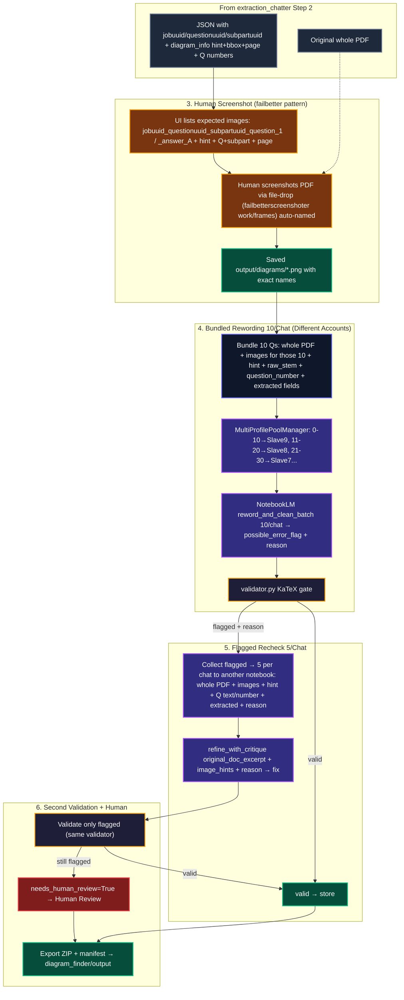

# Diagram Finder — End-to-End Flowchart (Steps 3-6 of workflowintext.txt)

> [!NOTE]
> Sister to `extraction_chatter` steps 1-2. Human-in-loop diagram capture + 10-per-chat bundling + 5-per-chat recheck.

